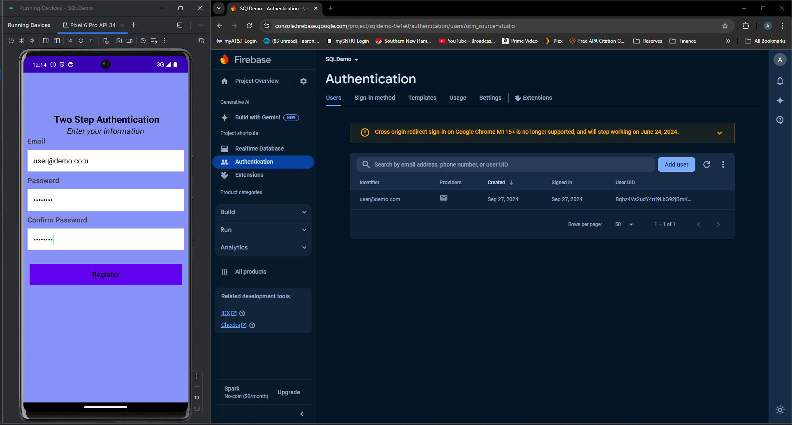

# CS-499 ePortfolio

# ePortfolio Summary
TODO: Add text here

# Professional Self-assessment
TODO: Add text here

## Code Review

[CS-499 Artifact Enhancement Code Review](https://youtu.be/R_RBc6R0Ds)

# Artifact Enhancement One: Software Design and Engineering

The  artifact I decided to improve is the Android mobile inventory management app from CS-360 Mobile Architecture and Programming. I chose this artifact because I thought it represented a significant enough challenge that I could show some skill in overcoming. In any case, this artifact is meant to showcase primarily a multifactor authentication feature as well as some other minor additions including improved CRUD operations and aesthetics. The multifactor authentication feature showcases the skills I have developed and the tenacity I’ve acquired through my time in the computer science program. At the end of this effort, I can say that I demonstrated an ability to use well-founded and innovative techniques, skills, and tools in computing practices to implement computer solutions that deliver value and accomplish industry-specific goals. With the implementation of two-factor authentication, I exhibited a security mindset that anticipates adversarial exploits in software architecture and designs to expose potential vulnerabilities, mitigate design flaws, and ensure privacy and enhanced security of data and resources.

This was by no means an easy project to revive, fix, or improve, so I’m particularly proud of how the 2FA worked out. Using Google Firebase to authenticate users was a new experience but learning to navigate its implementation was very beneficial. I am still far from fluent in Java and SQLite, but thanks to this project I am much more comfortable with both languages and how they can be used in tandem. Additionally, it was important for me to focus on getting the architecture and design piece correct so that everything could fall into place more naturally. I was somewhat right about it being a challenge, and although it may have been a little bit more on the ambitious side of challenging, I stuck with it and got it across the line. Looking forward, this artifact looks to be the hardest in terms of skill level so I’m excited to get it into my ePortfolio and close the book on it so I can move forward.

[Artifact One Enhancement Repo](https://github.com/asissom11/CS499/tree/main/Artifact_One_Android_App/StashTrackImproved)

# Artifact Enhancement Two: Data Structures and Algorithms

The artifact I decided to enhance for this stage in the course is the Pet Boarding and Grooming app from IT-145 Foundations in Application Development. This app handles the check-in and check-out of pets (only dogs and cats currently) and creates a billing statement to represent what the person at the check-in counter would be interfacing with. The source files were created at the start of my time at SNHU, so around 2020, and haven’t been touched since. In fact, I initially thought I had lost the source code altogether but it was saved on my old laptop.

This artifact belongs in my portfolio because it represents my knowledge of how to use Object-oriented programming principles with developed testing and quality assurance skills. The project enhancements also show how I develop applications while maintaining a security mindset, and that I am proficient in improving code efficiency. The artifact I selected was improved by adding a MySQL relational database to store the different data generated from pets and owners checking in for boarding and/or grooming services. Additionally, the existing class structure was altered to adhere to industry standard best practices for software development such as utilizing camel case naming conventions for variable and method definitions.

I employed strategies for building collaborative environments with this project by using clear and concise comments and adding detailed explanations of key functions, variable names, and logic flows. With well-documented logic, other team members can use my code to inform design and decision-making processes, such as how pet records are managed and what services are charged in the system. I have developed a security mindset that anticipates adversarial exploits by explicitly using prepared statements, safeguarding against SQL injection attacks. This security-first mindset aligns with the need to ensure the privacy and enhanced security of particularly sensitive data, such as pet owner details. In several parts of the code, I have handled edge cases like null values and invalid inputs, which also helps to prevent unexpected behaviors that could be exploited. I have designed and evaluated computing solutions that solve a given problem using algorithmic principles and computer science practices and standards by making design choices that manage complexity, such as using a HashMap for boarding spaces. This provides constant-time complexity (O(1)) for inserts and lookups, with an expected but necessary increase in memory usage versus a simple array structure. The checkout process showcases how I have accounted for edge cases like incorrect data and made the system robust against such errors.

[Artifact Two Enhancement Repo](https://github.com/asissom11/CS499/tree/main/Artifact_Two_Pet_BAG_App/Pet_BAG_enhanced)

# Artifact Enhancement Three: Databases

The selected artifact for the databases category is the Grazioso Salvare Rescue Animal Web App from SNHU’s CS-340 Client/Server Development course. This web application is designed to create a user-friendly interface that works with existing animal shelter databases to identify and categorize dogs suitable for rescue training and is built using Python and the Dash framework, with a non-relational MongoDB database. Python integration with MongoDB is handled by the PyMongo driver, which enables both database connection and manipulation with queries.

Specific reasons for inclusion of this enhanced artifact into my ePortfolio include demonstration of technical skill, problem-solving and adaptability, and alignment with industry standards. Recreating the project in a Windows environment was important in showing my ability to communicate clearly to both technical and non-technical audiences. The app’s core functions include importing CSV data files of available shelter animals into MongoDB, as well as managing dependencies like the PyMongo driver, various Python libraries, the Dash framework, and a Python CRUD module to manipulate the data in MongoDB. This artifact follows a multi-faceted architecture using the Model-View-Controller (MVC) pattern and RESTful protocols, making it a relevant and modern artifact to showcase development work.

The benefit of using the MVC pattern is its separation of concerns and in this structure, the model manages data with MongoDB and Python, the view controls the user interface through the Dash framework, and the controller handles data interactions between the model and view using the PyMongo driver. Each record in the MongoDB database is stored as a machine-readable BSON document, which the web app retrieves and displays in a human-readable JSON format. When the main app file is executed, the user can open a new browser tab, navigate to the appropriate address, and view the client-facing dashboard.

This artifact's enhancements focused on recreating the web app in a Windows environment after it was initially developed in the Apporto Virtual Lab, a university-hosted Linux service. In this process, I ensured that the software was designed to meet user needs and followed a well-organized structure. Using the initial documentation as a guide, I successfully recreated the web application environment and updated the documentation to reflect the steps taken to replicate and run the app on a Windows machine, highlighting my ability to design and deliver professional-quality written and visual communications that are technically sound, coherent, and appropriately adapted to the specific project details. The setup and execution processes were challenging, but I was able to demonstrate my ability to apply innovative techniques, skills, and tools throughout. This included configuring Python and MongoDB before following the app’s documentation. I also updated the source code to handle the latest versions of both the PyMongo driver and MongoDB platform, showcasing my ability to implement practical computer solutions that align with industry standards and deliver real value.

[Artifact Three Enhancement Repo](https://github.com/asissom11/CS499/tree/main/Artifact_Three_Animal_Shelter_Dashboard/CS_499_Artifact_Three_Enhanced_Files_Sissom_Aaron)
